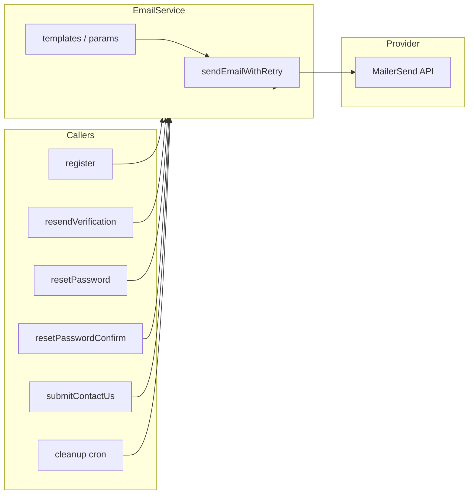

# Email Sending and Templates

## When to Use This Skill

- Sending any transactional email (auth, contact, notifications, chat, ad-related).
- Adding a new email type or template.
- Changing sender/support addresses, retries, or timeouts.
- Debugging or documenting email flow.

## Architecture (Single Path)

- **One provider:** MailerSend. **One service:** `EmailService`. No nodemailer/Gmail for app emails.
- **Env:** `MAILER_SEND_API_KEY` is required. Set it in local `.env` and in production (e.g. Kubernetes secret; see `infra/k8s-prod/client-depl.yaml`).
- **Flow:** Server action or API route → `EmailService.sendXxx(...)` → MailerSend. Do not use MailerSend directly outside EmailService.

## Email Types (Current)

| Type | Template file | Caller |
|------|----------------|--------|
| Verification | `templates/verification.ts` | `register.ts`, `resendVerificationEmail.ts` |
| Password reset | `templates/passwordReset.ts` | `resetPassword.ts` |
| Password reset success | `templates/passwordResetSuccess.ts` | `resetPasswordConfirm.ts` |
| Deletion warning | `templates/deletionWarning.ts` | `AccountCleanupService` (cron) |
| Account deletion | `templates/accountDeletion.ts` | `AccountCleanupService` (cron) |
| Contact us | (plain text in EmailService) | `submitContactUs.ts` |

## Template Convention

### Location and naming

- **Directory:** `client/src/lib/common/email/templates/`.
- **One file per email type:** e.g. `verification.ts`, `passwordReset.ts`, `passwordResetSuccess.ts`, `deletionWarning.ts`, `accountDeletion.ts`.
- **Export:** A function that returns HTML string (and optionally plain text), e.g. `getVerificationEmailHtml(verificationLink: string): string`.

### Shared structure

- Reuse the standard layout: `DOCTYPE html`, viewport meta, inline `<style>`, body with `.container` → `.logo` (img from Backblaze), `.header`, `.content`, `.button` for CTAs, `.footer` (support email, “do not reply”).
- Use shared constants from `client/src/lib/common/email/constants.ts`: `SUPPORT_EMAIL`, `TOKEN_EXPIRATION_MINUTES`, `UNVERIFIED_ACCOUNT_DELETION_DAYS`, `LOGO_URL`.
- Russian copy by default. If you add other locales later, document in this skill.

### EmailService role

- EmailService is a thin orchestrator: it imports template functions from `@/lib/common/email/templates/...`, builds `EmailParams` (from, to, subject, html, text), and calls `sendEmailWithRetry`. No long HTML strings live inside EmailService.

## Adding a New Transactional Email

1. **Create template:** Add a file under `client/src/lib/common/email/templates/` (e.g. `adNotification.ts`) with `getXxxEmailHtml(...)` and optionally `getXxxEmailText(...)`. Use constants from `constants.ts` and the shared layout (logo, header, content, footer).
2. **Add send method in EmailService:** In `client/src/lib/common/services/EmailService.ts`, add a public static method `sendXxxEmail(to, ...params, retries?)` that builds subject, html, and text from the template and calls `sendEmailWithRetry`.
3. **Call from app:** Invoke `EmailService.sendXxxEmail(...)` from the relevant server action or API route (e.g. when an ad is published or a chat message is sent). Catch errors and map to user-facing messages or logs.
4. **Update this skill:** Add the new type to the “Email types” table above (one-line summary, template file, caller).

## Technical Details

- **Retries and timeout:** 2 retries, exponential backoff (1s, 2s, 4s). Timeout: 45s in production, 20s in dev.
- **Payload:** Always set both `setHtml()` and `setText()` for accessibility and fallback.
- **Reply-to:** Use submitter for contact form; otherwise sender.
- **Errors:** EmailService methods throw on failure after retries. Callers should catch and map to user-facing messages or logs.
- **Constants:** Token expiration (15 min), unverified account deletion (21 days), sender/support emails live in `client/src/lib/common/email/constants.ts` and are used by EmailService and templates.

## Migration: AccountCleanupService

The account cleanup cron (`client/src/app/api/cron/cleanup-accounts/route.ts`) uses `processAccountCleanup` from `AccountCleanupService`. That service **must** use EmailService only: it calls `EmailService.sendDeletionWarningEmail(email, daysLeft, verificationLink)` and `EmailService.sendAccountDeletionEmail(email)`. It does not use nodemailer or Gmail. If you see nodemailer in AccountCleanupService, it has been migrated; the skill assumes the unified path.

## Out of Scope

- **EmailDisclaimer:** UI-only component (`client/src/components/EmailDisclaimer/EmailDisclaimer.tsx`) that displays text about email visibility. It is not part of sending.
- **MailerSend dashboard:** This skill does not document template management in the MailerSend UI. The current pattern is code-only HTML templates.

## Checklist (new email type)

- [ ] Template file in `lib/common/email/templates/` with `getXxxEmailHtml(...)` (and optional `getXxxEmailText(...)`).
- [ ] Public static method `sendXxxEmail(...)` in EmailService that builds params and calls `sendEmailWithRetry`.
- [ ] Caller (server action or API route) invokes `EmailService.sendXxxEmail(...)` and handles errors.
- [ ] Skill “Email types” table updated with the new type.

## Pitfalls

- **Sending outside EmailService:** Do not use MailerSend or nodemailer directly. All app emails go through EmailService.
- **Missing plain text:** Always provide both HTML and text for each send (accessibility and fallback clients).
- **Hardcoded credentials:** No Gmail or other SMTP credentials in code. Use `MAILER_SEND_API_KEY` only.

## References

- EmailService: `client/src/lib/common/services/EmailService.ts`
- Templates: `client/src/lib/common/email/templates/`
- Constants: `client/src/lib/common/email/constants.ts`
- Auth callers: `client/src/lib/auth/actions/register.ts`, `resendVerificationEmail.ts`, `resetPassword.ts`, `resetPasswordConfirm.ts`
- Contact: `client/src/lib/service/contact-us/actions/submitContactUs.ts`
- Cleanup: `client/src/lib/auth/services/AccountCleanupService.ts`, `client/src/app/api/cron/cleanup-accounts/route.ts`
