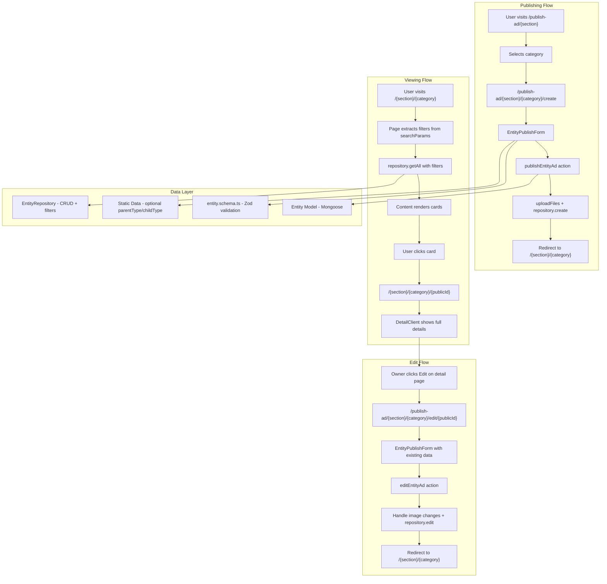

# End-to-End Implementation Guide

## Overview

This document provides a comprehensive guide for implementing end-to-end functionality for any section type (vehicles, pets, marketplace, services, etc.). It documents the complete flow from publishing an ad/listing to viewing, filtering, and editing, with reusable patterns that adapt to different section requirements.

## Placeholder System

Throughout this guide, use the following placeholders:

- `{section}` - Top-level section (e.g., "vehicles", "pets", "marketplace", "professional-service")
- `{category}` - Sub-category within section (e.g., "cars", "dogs", "electronics", "construction")
- `{Entity}` - Entity name in PascalCase (e.g., "Car", "Pet", "MarketplaceItem", "ProfessionalService")
- `{entity}` - Entity name in camelCase (e.g., "car", "pet", "marketplaceItem", "professionalService")
- `{parentType}` - Parent relationship type (e.g., "manufacturer", "breed", "brand", "species")
- `{childType}` - Child relationship type (e.g., "model", "type", "variant", "subcategory")
- `{folderPath}` - File upload folder path (e.g., "vehicles/cars", "pets/dogs", "marketplace/electronics")

## Architecture Diagram



## Section Categories Examples

Different sections may have different structures:

| Section | Example Categories | Has {parentType}/{childType} | Complexity |
|---------|-------------------|------------------------------|------------|
| `vehicles` | cars, motorcycles, scooters | Yes (manufacturer/model) | Complex |
| `pets` | dogs, cats, birds | Optional (breed/type or species/breed) | Medium |
| `marketplace` | electronics, furniture, clothing | Optional (brand/model) | Variable |
| `professional-service` | construction, legal, medical | No (category-based only) | Simple |
| `real-estate` | apartments, houses, commercial | No | Medium |

---

## Complete File Structure Template

For each new category within a section, create the following file structure:

### Data Layer (`lib/{section}/{category}/`)

```
lib/{section}/{category}/
├── actions/
│   ├── index.ts                          # Export all actions
│   ├── publish{Entity}Ad.ts              # Server action for creating ads
│   ├── edit{Entity}Ad.ts                 # Server action for editing ads
│   └── delete{Entity}Ad.ts               # Server action for deleting ads
├── models/
│   └── {Entity}.ts                       # Mongoose model definition
├── repository/
│   └── {Entity}Repository.ts             # Repository with CRUD + filtering
├── types/
│   ├── {entity}.schema.ts                # Zod validation schema
│   └── {entity}.types.ts                 # TypeScript types + enums
├── {category}{ParentType}s/              # Only if category has parentType/childType relationship
│   ├── data.ts                           # Static parentType/childType data
│   ├── index.ts                          # Export utility functions
│   └── types/
│       └── {entity}{ParentType}.schema.ts
└── {category}{ChildType}s/               # Only if category has parentType/childType relationship
    └── index.ts                          # ChildType selection utilities
```

### Section Layout (`app/(public)/{section}/`)

**IMPORTANT: Always create section layout with stripe image for new sections.**

For sections that need a layout wrapper with header and stripe image:

```
app/(public)/{section}/
├── layout.tsx                            # Section layout (Server Component) - REQUIRED
└── layout.styles.ts                      # Layout styled components - REQUIRED
```

**When to create:**
- **Always create** `layout.tsx` and `layout.styles.ts` for new sections
- Provides visual branding with hero stripe image
- Wraps entire section with `SimpleHeader` and stripe
- Required for consistent section appearance (vehicles, pets, professional-service, yad2, real-estate all have this)

**layout.tsx pattern:**
```typescript
import type { Metadata } from "next";
import {
  {Section}LayoutSection,
  {Section}LayoutStripe,
} from "./layout.styles";
import { generateBackblazeUrl } from "@/utils/common";
import SimpleHeader from "@/components/Header/SimpleHeader/SimpleHeader";

export const metadata: Metadata = {
  title: "Section Title",
  description: "Section description",
};

export default function RootLayout({
  children,
}: Readonly<{
  children: React.ReactNode;
}>) {
  const filePath = generateBackblazeUrl("public", "{section}-stripe-placeholder.jpeg");

  return (
    <{Section}LayoutSection>
      <SimpleHeader />
      <{Section}LayoutStripe $src={filePath} />
      <main>{children}</main>
    </{Section}LayoutSection>
  );
}
```

**layout.styles.ts pattern:**
```typescript
"use client";
import { Box } from "@radix-ui/themes";
import styled from "styled-components";

export const {Section}LayoutSection = styled.section`
  display: flex;
  flex-direction: column;

  &:before {
    content: "";
    display: block;
    height: var(--header-height);
  }

  main {
    flex: 1;
    padding: 0.5rem;
  }
`;

export const {Section}LayoutStripe = styled(Box)<{ $src: string }>`
  height: 270px;
  position: relative;
  background-image: url(${({ $src }) => $src});
  background-size: cover;
  background-position: 0px 35%;
  background-repeat: no-repeat;
`;
```

**Key Points:**
- Layout wraps entire section with `SimpleHeader` and hero stripe image
- Stripe image uses `generateBackblazeUrl` for S3-compatible storage
- Layout section provides proper spacing for header
- Main content area has consistent padding
- **Use when:** Section needs visual branding with stripe image (e.g., vehicles, professional-service, yad2)

**References:**
- `app/(public)/vehicles/layout.tsx`
- `app/(public)/vehicles/layout.styles.ts`
- `app/(public)/professional-service/layout.tsx`
- `app/(public)/professional-service/layout.styles.ts`
- `app/(public)/yad2/layout.tsx`
- `app/(public)/yad2/layout.styles.ts`

### Public Pages (`app/(public)/{section}/{category}/`)

```
app/(public)/{section}/{category}/
├── page.tsx                              # Listing page (Server Component)
├── page.styles.ts                        # Page styled components
├── loading.tsx                           # Loading skeleton
├── loading.styles.ts                     # Loading styled components
├── [id]/
│   └── page.tsx                          # Detail page (Server Component)
└── _components/
    ├── {Entity}Content/
    │   └── {Entity}Content.tsx           # Content with data fetching
    ├── {Entity}Cards/
    │   ├── {Entity}Card.tsx              # Individual card component
    │   ├── {Entity}Card.styles.ts        # Card styled components
    │   └── {Entity}Cards.tsx             # Cards list wrapper
    ├── {Entity}DetailClient/
    │   ├── {Entity}DetailClient.tsx      # Detail client component
    │   └── {Entity}DetailClient.styles.ts
    ├── Filters/
    │   ├── Filters.tsx                   # Filters wrapper
    │   ├── FiltersClient.tsx             # Filters logic (Client Component)
    │   ├── Filters.styles.ts             # Filter styled components
    │   ├── Filters.utils.ts              # Filter helper functions
    │   └── filters.types.ts              # Filter Zod schema
    └── modals/
        └── MoreFiltersModal/
            ├── MoreFiltersModal.tsx
            └── MoreFiltersModal.styles.ts
```

### Private Pages (`app/(private)/publish-ad/{section}/{category}/`)

```
app/(private)/publish-ad/{section}/{category}/
└── [formMode]/
    ├── page.tsx                          # Create page (formMode === 'create')
    ├── page.styles.ts                    # Page styled components
    └── [id]/
        └── page.tsx                      # Edit page (formMode === 'edit')
```

### Form Component (`app/(private)/publish-ad/_components/{section}/`)

```
app/(private)/publish-ad/_components/{section}/
└── {Entity}PublishForm/
    ├── {Entity}PublishForm.tsx           # Form component (create + edit)
    └── {Entity}PublishForm.styles.ts     # Form styled components
```

---

## Base Schema Pattern

Base fields are **configurable per section**. Choose the pattern that fits your section's needs.

### Common Field Patterns

#### Standard Pattern (Most Common)

For sections that require pricing (marketplace, vehicles, real estate):

```typescript
interface IBaseStandardAd {
  // Identification
  id: string;
  publicId: string;                       // nanoid(10) - public-facing ID
  user: mongoose.Types.ObjectId;          // Reference to User model
  
  // Pricing
  price: number;                          // Required, stored as number
  
  // Description
  description: string;                    // Required
  
  // Location
  district: string;                       // Required - enum Districts
  city: string;                           // Required - city ID
  
  // Contact Information
  contactName: string;                    // Required
  contactPrimaryPhone: string;            // Required - digits only
  contactSecondaryPhone?: string;         // Optional
  contactEmail: string;                   // Required - valid email
  
  // Terms
  acceptTerms: boolean;                   // Required - must be true
  
  // Media
  images: FileUploadItem[];               // Required - at least 1 image
  
  // Timestamps (auto-generated by Mongoose)
  createdAt?: Date;
  updatedAt?: Date;
}
```

**Examples**: vehicles, marketplace, real-estate

#### Adoption Pattern (No Price)

For sections where items are given away (pets adoption, free items):

```typescript
interface IBaseAdoptionAd {
  // Identification
  id: string;
  publicId: string;
  user: mongoose.Types.ObjectId;
  
  // Description
  description: string;                    // Required
  
  // Location
  district: string;                       // Required
  city: string;                           // Required
  
  // Contact Information
  contactName: string;                    // Required
  contactPrimaryPhone: string;            // Required
  contactSecondaryPhone?: string;         // Optional
  contactEmail: string;                   // Required
  
  // Terms
  acceptTerms: boolean;                   // Required
  
  // Media
  images: FileUploadItem[];               // Required - at least 1 image
  
  // Timestamps
  createdAt?: Date;
  updatedAt?: Date;
}
```

**Examples**: pets (adoption), free items marketplace

#### Free Pattern (Optional Price)

For sections where items can be free or paid (marketplace with free section):

```typescript
interface IBaseFreeAd {
  // Same as Standard Pattern but with optional price
  price?: number;                         // Optional
  
  // ... rest same as Standard Pattern
}
```

**Examples**: marketplace with free section, community board

#### Service Pattern (No Price or Price Optional)

For service listings (professional services):

```typescript
interface IBaseServiceAd {
  // Identification
  id: string;
  publicId: string;
  user: mongoose.Types.ObjectId;
  
  // Service-specific
  title: string;                          // Required - service title
  serviceCategory: string;                // Required - category enum
  
  // Description
  description: string;                    // Required
  
  // Location
  district: string;                       // Required
  city: string;                           // Required
  
  // Contact Information
  contactName: string;                    // Required
  contactPrimaryPhone: string;            // Required
  contactSecondaryPhone?: string;         // Optional
  contactEmail: string;                   // Required
  
  // Terms
  acceptTerms: boolean;                   // Required
  
  // Media (optional for services)
  images?: FileUploadItem[];              // Optional - may not have images
  
  // Timestamps
  createdAt?: Date;
  updatedAt?: Date;
}
```

**Examples**: professional-service, services marketplace

### Common Zod Schema Fields

Choose the base fields that match your section's pattern:

```typescript
// Standard Pattern Base Fields
const baseStandardSchemaFields = {
  price: z
    .string({ required_error: "Введите цену" })
    .refine((val) => /^-?\d[\d,]*$/.test(val), {
      message: "Цена должна быть числом, содержащим запятые.",
    })
    .transform((val) => {
      const cleaned = val.replace(/,/g, "");
      return Number(cleaned);
    }),
  
  description: z.string({ required_error: "Введите описание" }),
  
  district: z.nativeEnum(Districts, { required_error: "Выберите район" }),
  
  city: z.string({ required_error: "Выберите город" }),
  
  contactName: z.string({ required_error: "Введите имя контакта" }),
  
  contactPrimaryPhone: z
    .string({ required_error: "Введите основной телефон" })
    .regex(/^[0-9]+$/, "Телефон может содержать только цифры"),
  
  contactSecondaryPhone: z
    .string()
    .regex(/^[0-9]+$/, "Телефон может содержать только цифры")
    .optional(),
  
  contactEmail: z
    .string({ required_error: "Электронная почта обязательна" })
    .email("Введите корректный адрес электронной почты"),
  
  acceptTerms: z
    .string({ required_error: "Вы должны согласиться с условиями" })
    .optional()
    .superRefine((value, ctx) => {
      if (value === "on") return true;
      ctx.addIssue({
        code: z.ZodIssueCode.custom,
        message: "Вы должны согласиться с условиями",
        fatal: true,
      });
      return z.NEVER;
    }),
  
  images: z
    .array(z.instanceof(File))
    .min(1, "Загрузите хотя бы 1 изображение")
    .superRefine((files, ctx) => {
      // File validation logic - see examples below
    }),
};

// Adoption Pattern - Remove price field
// Free Pattern - Make price optional
// Service Pattern - Add title, serviceCategory, make images optional
```

### Common Mongoose Schema Fields

```typescript
// Standard Pattern Base Mongoose Schema
const baseStandardSchemaDefinition = {
  publicId: {
    type: String,
    required: true,
    unique: true,
  },
  user: {
    type: mongoose.Schema.Types.ObjectId,
    ref: "User",
    required: true,
    index: true,
  },
  price: {
    type: Number,
    required: true,              // Make optional for Free Pattern
    min: 0,
    index: true,
  },
  description: {
    type: String,
    required: true,
  },
  district: {
    type: String,
    required: true,
    index: true,
  },
  city: {
    type: String,
    required: true,
    index: true,
  },
  contactName: {
    type: String,
    required: true,
  },
  contactPrimaryPhone: {
    type: String,
    required: true,
  },
  contactSecondaryPhone: {
    type: String,
    required: false,
  },
  contactEmail: {
    type: String,
    required: true,
    lowercase: true,
    trim: true,
  },
  acceptTerms: {
    type: Boolean,
    required: true,
  },
  images: {
    type: [imageSchema],
    required: true,              // Make optional for Service Pattern
  },
};

// Image schema (reuse across all categories)
const imageSchema = new mongoose.Schema(
  {
    originalName: { type: String, required: true },
    uniqueName: { type: String, required: true },
    url: { type: String, required: true },
    fieldname: { type: String, required: true },
    versionId: { type: String, required: false },
    folderName: { type: String, required: true },
  },
  {
    toJSON: {
      transform: (_doc, ret) => {
        ret.id = ret._id;
        delete ret._id;
      },
    },
  }
);
```

---

## Optional: Parent/Child Relationship Pattern

Some sections benefit from hierarchical relationships (like manufacturer/model). This is **optional** - use only when needed.

### When to Use Parent/Child Relationships

**Use when:**
- Categories have clear parent-child hierarchies (e.g., manufacturer → model, breed → type, brand → variant)
- Users need to filter by both parent and child
- Child options depend on parent selection

**Don't use when:**
- Categories are flat (e.g., professional services, simple marketplace items)
- No clear hierarchical relationship exists
- Single category enum is sufficient

### Relationship Examples

| Section | Parent Type | Child Type | Example |
|---------|------------|------------|---------|
| vehicles | manufacturer | model | Toyota → Corolla |
| pets | breed | type | Golden Retriever → Standard |
| marketplace | brand | model | Apple → iPhone 15 |
| marketplace | category | subcategory | Electronics → Smartphones |

### Implementing Parent/Child Relationships

#### 1. Types Structure

```typescript
// lib/{section}/{category}/types/{entity}.types.ts

export interface I{Entity} extends IBaseStandardAd {  // Or your chosen base pattern
  {parentType}: string;                    // Required - parent selection
  {childType}: string;                     // Required - child selection
  // ... other entity-specific fields
}

// Example: vehicles/cars
// manufacturer: string;  // parentType
// model: string;         // childType

// Example: pets/dogs
// breed: string;         // parentType
// type: string;          // childType (optional - depends on breed)
```

#### 2. Static Data Structure

```
lib/{section}/{category}/
└── {category}{ParentType}s/
    ├── data.ts                           # Static parentType/childType data
    ├── index.ts                          # Export utility functions
    └── types/
        └── {entity}{ParentType}.schema.ts
```

#### 3. Data Format

```typescript
// lib/{section}/{category}/{category}{ParentType}s/data.ts

export interface {Entity}{ParentType} {
  id: string;
  name: string;
  {childType}s: {Entity}{ChildType}[];    // Child options for this parent
}

export interface {Entity}{ChildType} {
  id: string;
  name: string;
}

// Example: vehicles/cars/carManufacturers/data.ts
// export interface CarManufacturer { id: string; name: string; models: CarModel[]; }

export const {category}{ParentType}sData: Record<string, {Entity}{ParentType}> = {
  "parent1": {
    id: "parent1",
    name: "Parent 1",
    {childType}s: [
      { id: "child1", name: "Child 1" },
      { id: "child2", name: "Child 2" },
    ],
  },
  // ... more parents
};
```

#### 4. Utility Functions

```typescript
// lib/{section}/{category}/{category}{ParentType}s/index.ts

export const map{Entity}{ParentType}sToSelectOptions = (): Option[] => {
  return Object.values({category}{ParentType}sData).map((parent) => ({
    value: parent.id,
    label: parent.name,
  }));
};

export const get{Entity}{ChildType}sToSelectOptions = (
  {parentType}Id: string
): Option[] => {
  const parent = {category}{ParentType}sData[{parentType}Id];
  if (!parent) return [];
  return parent.{childType}s.map((child) => ({
    value: child.id,
    label: child.name,
  }));
};

export const get{Entity}{ChildType}sToSelectOptionsBy{ParentType}Ids = (
  {parentType}Ids: string[]
): Option[] => {
  return {parentType}Ids.flatMap((id) => 
    get{Entity}{ChildType}sToSelectOptions(id)
  );
};
```

---

## Example Schema: Complex Category (With Parent/Child Relationship)

This example shows a category with parent/child relationships and entity-specific fields.

### Types (`lib/{section}/{category}/types/{entity}.types.ts`)

```typescript
import { IBaseStandardAd } from "@/lib/{section}/common/types";  // Or your chosen base
import { SerializedUser } from "@/lib/auth/types/auth.schema";

// Entity-specific enums
export enum {Entity}Category {
  VALUE1 = "value1",
  VALUE2 = "value2",
  // ... more categories
}

export enum {Entity}Status {
  NEW = "new",
  USED = "used",
  // ... more statuses
}

// Entity interface extending base
export interface I{Entity} extends IBaseStandardAd {  // Or IBaseAdoptionAd, etc.
  // Parent/Child relationship (if applicable)
  {parentType}: string;                    // e.g., manufacturer, breed, brand
  {childType}: string;                     // e.g., model, type, variant
  
  // Entity-specific required fields
  {entity}Category: {Entity}Category;      // Required enum
  {entity}Status: {Entity}Status;          // Required enum
  
  // Entity-specific optional fields
  yearOfManufacture?: number;              // Optional - depends on entity type
  condition?: string;                      // Optional text field
  notes?: string;                          // Optional free-form text
  
  // Base fields are inherited from IBaseStandardAd (price, description, etc.)
}

// Serialized type for client-side use
export interface Serialized{Entity}
  extends Omit<I{Entity}, "createdAt" | "updatedAt" | "user"> {
  updatedAt: string;
  createdAt: string;
  user: SerializedUser;
}
```

### Zod Schema (`lib/{section}/{category}/types/{entity}.schema.ts`)

```typescript
import { z } from "zod";
import { Districts } from "@/lib/cities/types/cities.schema";
import { {Entity}Category, {Entity}Status } from "./{entity}.types";

export const SIZE_IN_MB = 5;
export const MAX_FILE_SIZE = SIZE_IN_MB * 1024 * 1024;
export const MAX_FILES = 5;

export const ACCEPTED_FILE_TYPES = [
  "image/png",
  "image/jpeg",
  "image/jpg",
  "image/webp",
];

export const create{Entity}Schema = ({ minNumberOfImages = 1 }) => {
  return z.object({
    // Parent/Child relationship fields (if applicable)
    {parentType}: z.string({ required_error: "Выберите {parentType}" }),
    {childType}: z.string({ required_error: "Выберите {childType}" }),
    
    // Entity-specific fields
    {entity}Category: z.nativeEnum({Entity}Category, {
      required_error: "Выберите категорию",
    }),
    {entity}Status: z.nativeEnum({Entity}Status, {
      required_error: "Выберите состояние",
    }),
    
    // Optional fields
    yearOfManufacture: z.coerce
      .number({ invalid_type_error: "Год должен быть числом" })
      .min(1900, "Год должен быть не менее 1900")
      .optional(),
    condition: z.string().optional(),
    notes: z.string().optional(),
    
    // Base fields (from your chosen base pattern)
    // Standard Pattern:
    price: z
      .string({ required_error: "Введите цену" })
      .refine((val) => /^-?\d[\d,]*$/.test(val), {
        message: "Цена должна быть числом.",
      })
      .transform((val) => Number(val.replace(/,/g, ""))),
    
    description: z.string({ required_error: "Введите описание" }),
    district: z.nativeEnum(Districts, { required_error: "Выберите район" }),
    city: z.string({ required_error: "Выберите город" }),
    contactName: z.string({ required_error: "Введите имя контакта" }),
    contactPrimaryPhone: z
      .string({ required_error: "Введите основной телефон" })
      .regex(/^[0-9]+$/, "Телефон может содержать только цифры"),
    contactSecondaryPhone: z
      .string()
      .regex(/^[0-9]+$/, "Телефон может содержать только цифры")
      .optional(),
    contactEmail: z
      .string({ required_error: "Электронная почта обязательна" })
      .email("Введите корректный адрес электронной почты"),
    acceptTerms: z
      .string()
      .optional()
      .superRefine((value, ctx) => {
        if (value === "on") return true;
        ctx.addIssue({
          code: z.ZodIssueCode.custom,
          message: "Вы должны согласиться с условиями",
          fatal: true,
        });
        return z.NEVER;
      }),
    images: z
      .array(z.instanceof(File))
      .min(minNumberOfImages, `Загрузите хотя бы ${minNumberOfImages} изображений`)
      .superRefine((files, ctx) => {
        const validFiles = files.filter(
          (file) => file.size > 0 && file.name !== "undefined"
        );
        if (validFiles.length > 0) {
          if (files.length > MAX_FILES) {
            ctx.addIssue({
              code: z.ZodIssueCode.custom,
              message: `Максимальное количество изображений: ${MAX_FILES}`,
              fatal: true,
            });
            return z.NEVER;
          }
          validFiles.forEach((file) => {
            if (file.size > MAX_FILE_SIZE) {
              ctx.addIssue({
                code: z.ZodIssueCode.custom,
                message: `Файл слишком большой. Максимальный размер: ${SIZE_IN_MB}MB`,
              });
            }
            if (!new Set(ACCEPTED_FILE_TYPES).has(file.type)) {
              ctx.addIssue({
                code: z.ZodIssueCode.custom,
                message: `Файл должен быть изображением (PNG, JPEG, JPG или WebP)`,
                fatal: true,
              });
              return z.NEVER;
            }
          });
        }
        return true;
      }),
  });
};

export type {Entity}FormData = z.infer<ReturnType<typeof create{Entity}Schema>>;
```

---

## Example Schema: Simple Category (No Parent/Child Relationship)

This example shows a category without parent/child relationships - uses simple category enums instead.

### Types (`lib/{section}/{category}/types/{entity}.types.ts`)

```typescript
import { SerializedUser } from "@/lib/auth/types/auth.schema";
import { FileUploadItem } from "@/lib/files/uploadFiles";
import mongoose from "mongoose";

// Entity-specific enums
export enum {Entity}Category {
  CATEGORY1 = "category1",
  CATEGORY2 = "category2",
  // ... more categories
}

export enum {Entity}Condition {
  NEW = "new",
  USED = "used",
  REFURBISHED = "refurbished",
}

export interface I{Entity} extends IBaseStandardAd {  // Or your chosen base pattern
  // Entity-specific fields
  title: string;                          // Required - item name
  {entity}Category: {Entity}Category;     // Required
  {entity}Condition: {Entity}Condition;   // Required
  subcategory?: string;                   // Optional - freeform text
  brand?: string;                         // Optional
  
  // Base fields inherited from IBaseStandardAd
}

export interface Serialized{Entity}
  extends Omit<I{Entity}, "createdAt" | "updatedAt" | "user"> {
  updatedAt: string;
  createdAt: string;
  user: SerializedUser;
}
```

### Zod Schema (Simple Category)

```typescript
export const create{Entity}Schema = ({ minNumberOfImages = 1 }) => {
  return z.object({
    // Entity-specific fields
    title: z.string({ required_error: "Введите название" })
      .min(3, "Название должно содержать минимум 3 символа"),
    {entity}Category: z.nativeEnum({Entity}Category, {
      required_error: "Выберите категорию",
    }),
    {entity}Condition: z.nativeEnum({Entity}Condition, {
      required_error: "Выберите состояние",
    }),
    subcategory: z.string().optional(),
    brand: z.string().optional(),
    
    // Base fields (from your chosen base pattern)
    // ... same as complex category example
  });
};
```

---

## Step-by-Step Implementation Checklist

Use this checklist when implementing a new category within a section:

### Phase 1: Data Layer

- [ ] **1.1** Create types file (`lib/{section}/{category}/types/{entity}.types.ts`)
  - Define entity-specific enums
  - Define `I{Entity}` interface extending your chosen base pattern
  - Define `Serialized{Entity}` type for client-side use

- [ ] **1.2** Create Zod schema (`lib/{section}/{category}/types/{entity}.schema.ts`)
  - Define file upload constants (`MAX_FILE_SIZE`, `MAX_FILES`)
  - Create `create{Entity}Schema({ minNumberOfImages })` function
  - Include all entity-specific and base validation fields
  - Export `{Entity}FormData` type

- [ ] **1.3** Create Mongoose model (`lib/{section}/{category}/models/{Entity}.ts`)
  - Import `FileUploadItem` from `@/lib/files/uploadFiles`
  - Define `imageSchema` for embedded images
  - Define `{entity}Schema` with all fields and indexes
  - Export model with singleton pattern

- [ ] **1.4** Create repository (`lib/{section}/{category}/repository/{Entity}Repository.ts`)
  - Define `{Entity}SearchFilters` interface
  - Implement `getAll(filters, page, pageSize)` with sanitization
  - Implement `getByPublicId(publicId)`
  - Implement `create(data)`
  - Implement `edit(publicId, updateData)`
  - Implement `delete(publicId)`
  - Export singleton instance

### Phase 2: Static Data (If Parent/Child Relationship Required)

**⚠️ SKIP THIS PHASE if your category doesn't have parent/child relationships.**

- [ ] **2.1** Create parentType schema (`lib/{section}/{category}/{category}{ParentType}s/types/{entity}{ParentType}.schema.ts`)
  - Define `{Entity}{ChildType}` interface
  - Define `{Entity}{ParentType}` interface
  - Export type aliases

- [ ] **2.2** Create parentType data (`lib/{section}/{category}/{category}{ParentType}s/data.ts`)
  - Define all parentTypes with their childTypes
  - Use `satisfies Record<ParentTypeId, ParentType>` for type safety

- [ ] **2.3** Create parentType utilities (`lib/{section}/{category}/{category}{ParentType}s/index.ts`)
  - Export `map{Entity}{ParentType}sToSelectOptions()`
  - Export caching utilities

- [ ] **2.4** Create childType utilities (`lib/{section}/{category}/{category}{ChildType}s/index.ts`)
  - Export `get{Entity}{ChildType}sToSelectOptions({parentType}Id)`
  - Export `get{Entity}{ChildType}sToSelectOptionsBy{ParentType}Ids(ids)`

### Phase 3: Server Actions

- [ ] **3.1** Create publish action (`lib/{section}/{category}/actions/publish{Entity}Ad.ts`)
  - Parse form data with Zod schema
  - Get current user
  - Upload files to `{section}/{category}` folder
  - Create entity via repository
  - Revalidate and redirect

- [ ] **3.2** Create edit action (`lib/{section}/{category}/actions/edit{Entity}Ad.ts`)
  - Accept context with `publicId`, `imagesToDelete`, `allImagesShouldBeDeleted`
  - Handle image deletion before uploading new ones
  - Merge existing and new images
  - Update via repository

- [ ] **3.3** Create delete action (`lib/{section}/{category}/actions/delete{Entity}Ad.ts`)
  - Verify user authentication and ownership
  - Delete images from storage
  - Delete entity via repository
  - Create version with redirect

- [ ] **3.4** Create actions index (`lib/{section}/{category}/actions/index.ts`)
  - Export all actions

### Phase 4: Publish Form

- [ ] **4.1** Create form component (`app/(private)/publish-ad/_components/{section}/{Entity}PublishForm/{Entity}PublishForm.tsx`)
  - Accept `entity?: Serialized{Entity}` and `formMode: FormMode` props
  - Use `useForm` with `@conform-to/react`
  - Handle existing images state for edit mode
  - Implement all form sections (entity-specific, price if applicable, location, photos, contact)
  - Use `SelectSingle` for dropdowns, `BasicFormField` for inputs
  - Use `PriceFormField` for price (if applicable), `PhoneFormField` for phones
  - Use `DropFilesInput` and `ImagesPreviewer` for images

- [ ] **4.2** Create form styles (`app/(private)/publish-ad/_components/{section}/{Entity}PublishForm/{Entity}PublishForm.styles.ts`)
  - **Add `"use client"` directive at the top** (required for styled-components)
  - Copy from similar form styles or create new

- [ ] **4.3** Create create page (`app/(private)/publish-ad/{section}/{category}/[formMode]/page.tsx`)
  - Validate `formMode` with schema
  - Return `notFound()` if `formMode === FormMode.Edit`
  - Render form with `FormMode.Create`

- [ ] **4.4** Create edit page (`app/(private)/publish-ad/{section}/{category}/[formMode]/[id]/page.tsx`)
  - Validate `formMode` with schema
  - Return `notFound()` if `formMode === FormMode.Create`
  - Fetch entity by publicId
  - Verify ownership with `thisUserIsOwner`
  - Render form with `FormMode.Edit` and entity data

- [ ] **4.5** Create page styles (`app/(private)/publish-ad/{section}/{category}/[formMode]/page.styles.ts`)
  - **Add `"use client"` directive at the top** (required for styled-components)

### Phase 5: Listing Page

**⚠️ IMPORTANT: Create Phase 6 (Filters) BEFORE or AT THE SAME TIME as Phase 5.1, since the page imports Filters component.**

- [ ] **5.1** Create page (`app/(public)/{section}/{category}/page.tsx`)
  - **⚠️ CRITICAL: Ensure Filters component exists (Phase 6.1) before importing it here**
  - Define `searchParams` interface with filter params
  - Extract and process filters using `searchParamsToFilters`
  - Create `contentKey` for Suspense
  - Render `Filters` and `Content` in Suspense

- [ ] **5.2** Create page styles (`app/(public)/{section}/{category}/page.styles.ts`)
  - **Add `"use client"` directive at the top** (required for styled-components)
  - Define `{Category}PageContainer`, `{Entity}Grid`, `StickyPaginationWrapper`, `Title`

- [ ] **5.3** Create loading component (`app/(public)/{section}/{category}/loading.tsx`)
  - Render skeleton cards (6 by default)

- [ ] **5.4** Create loading styles (`app/(public)/{section}/{category}/loading.styles.ts`)
  - **Add `"use client"` directive at the top** (required for styled-components)

- [ ] **5.5** Create content component (`app/(public)/{section}/{category}/_components/{Entity}Content/{Entity}Content.tsx`)
  - Fetch data with `repository.getAll(filters, currentPage, pageSize)`
  - Render title, results count, grid of cards, pagination

- [ ] **5.6** Create card component (`app/(public)/{section}/{category}/_components/{Entity}Cards/{Entity}Card.tsx`)
  - Display image carousel, title, key specs, price (if applicable), location
  - Use appropriate formatting helpers

- [ ] **5.7** Create card styles (`app/(public)/{section}/{category}/_components/{Entity}Cards/{Entity}Card.styles.ts`)
  - **Add `"use client"` directive at the top** (required for styled-components)

- [ ] **5.8** Create cards list (`app/(public)/{section}/{category}/_components/{Entity}Cards/{Entity}Cards.tsx`)
  - Map entities to Link + Card components

### Phase 6: Filters

**⚠️ IMPORTANT: Create this phase BEFORE or AT THE SAME TIME as Phase 5.1, since the listing page imports the Filters component.**

- [ ] **6.1** Create filters wrapper (`app/(public)/{section}/{category}/_components/Filters/Filters.tsx`)
  - Use section-specific wrapper component if available (e.g., `VehicleFilters`)
  - Or use `FiltersProvider` directly if no wrapper needed
  - Pass `activeFiltersCount` from searchParams

- [ ] **6.2** Create filters client (`app/(public)/{section}/{category}/_components/Filters/FiltersClient.tsx`)
  - Define `allSelectedFilterOptions` Map state with all filter params
  - Define `moreFilters` state for text inputs (price, etc.)
  - Implement `handleSubmitAllFilters`, `handleSetAllSelectedFilterOptions`, `handleClearFilters`
  - Use `SearchMultiSelect` for multi-select filters
  - Use `SearchSingleSelect` for single-select filters
  - Use `SearchCheckboxButtonGroup` for array-of-checkbox filters (e.g. pet adjustments) in "more filters"
  - Use `DialogPrimitiveButton` to group related filters
  - Use `PriceTextSearch` for price range (if applicable)
  - Render desktop and mobile filter layouts

- [ ] **6.3** Create filters types (`app/(public)/{section}/{category}/_components/Filters/filters.types.ts`)
  - Define Zod schema for text input validation
  - Import `PriceFromToSchema` from common types (if price filters needed)

- [ ] **6.4** Create filters utils (`app/(public)/{section}/{category}/_components/Filters/Filters.utils.ts`)
  - Helper functions for filter button titles

- [ ] **6.5** Create filters styles (`app/(public)/{section}/{category}/_components/Filters/Filters.styles.ts`)
  - **Add `"use client"` directive at the top** (required for styled-components)

- [ ] **6.6** Create more filters modal (`app/(public)/{section}/{category}/_components/modals/MoreFiltersModal/`)
  - Modal for additional filters (district, city, price if applicable, etc.)
  - **Add `"use client"` directive at the top of `.styles.ts` file** (required for styled-components)

### Phase 7: Detail Page

- [ ] **7.1** Create detail page (`app/(public)/{section}/{category}/[id]/page.tsx`)
  - Fetch entity by publicId
  - Return `notFound()` if not found
  - Render detail client component

- [ ] **7.2** Create detail client (`app/(public)/{section}/{category}/_components/{Entity}DetailClient/{Entity}DetailClient.tsx`)
  - Display image gallery with modal
  - Display all entity information sections
  - Display contact information (mask email, show phone for authenticated users)
  - Owner actions: Edit button (link), Delete button with confirmation modal
  - Error modal for delete errors

- [ ] **7.3** Create detail styles (`app/(public)/{section}/{category}/_components/{Entity}DetailClient/{Entity}DetailClient.styles.ts`)
  - **Add `"use client"` directive at the top** (required for styled-components)

### Phase 8: Integration

- [ ] **8.1** Update section navigation/filters wrapper (if applicable)
  - Add category to section-specific navigation array with correct `href`
  - Example: `app/(public)/{section}/_components/Filters/{Section}Filters/{Section}Filters.tsx`

- [ ] **8.2** Update publish-ad categories page (`app/(private)/publish-ad/{section}/page.tsx`)
  - Verify category is in section categories array with correct `href`

---

## Key Code Patterns Reference

### File Upload Pattern

```typescript
// In publish action
const uploadResult = await uploadFiles(
  "{section}/{category}",  // Folder path - e.g., "vehicles/cars", "pets/dogs"
  user.id,                 // User ID
  uploadFormData           // FormData with 'files' field
);
```

### Repository Filter Pattern

```typescript
// Always sanitize incoming filters
const sanitizedFilters = {
  field: sanitize(searchFilters.field),
};

// Build MongoDB query
const searchFilter: FilterQuery<typeof Entity> = {};

// Multi-value filter
if (sanitizedFilters.field) {
  searchFilter.field = { $in: sanitizedFilters.field };
}

// Range filter
if (sanitizedFilters.valueFrom) {
  const num = Number(sanitizedFilters.valueFrom);
  if (!Number.isNaN(num)) {
    searchFilter.numericField = { $gte: num };
  }
}

// Text search filter
if (sanitizedFilters.textSearch?.trim()) {
  searchFilter.fieldName = {
    $regex: sanitizedFilters.textSearch.trim(),
    $options: "i", // Case-insensitive
  };
}
```

### Form Create/Edit Mode Pattern

```typescript
// Form component accepts mode and optional entity
interface FormProps {
  entity?: SerializedEntity;
  formMode: FormMode;
}

// Check mode
const isCreateMode = formMode === FormMode.Create;

// Use appropriate action
const [formState, formAction, isPending] = useActionState(
  isCreateMode ? publishEntityAd : updateEntityWithImagesToDelete,
  undefined
);

// Populate defaults from entity in edit mode
const [form, fields] = useForm({
  defaultValue: {
    field: entity?.field || "",
    // ...
  },
});
```

### Detail Page Owner Actions Pattern

```typescript
const { user: currentUser, thisUserIsOwner } = useAuth();
const isOwner = thisUserIsOwner(entity.user.id);

// Conditionally render edit/delete buttons
{isOwner && (
  <ButtonGroup>
    <Button asChild>
      <Link href={`/publish-ad/{section}/{category}/edit/${publicId}`}>
        Редактировать
      </Link>
    </Button>
    <Button onClick={() => setDeleteConfirmationModalOpen(true)}>
      Удалить
    </Button>
  </ButtonGroup>
)}
```

---

## URL Patterns

| Action | URL Pattern | Example |
|--------|-------------|---------|
| Category selection (publish) | `/publish-ad/{section}` | `/publish-ad/vehicles` |
| Create ad | `/publish-ad/{section}/{category}/create` | `/publish-ad/vehicles/cars/create` |
| Edit ad | `/publish-ad/{section}/{category}/edit/{publicId}` | `/publish-ad/vehicles/cars/edit/abc123` |
| View listings | `/{section}/{category}` | `/vehicles/cars` |
| View detail | `/{section}/{category}/{publicId}` | `/vehicles/cars/abc123` |

---

## Common Utilities

### Location

```typescript
import { mapAreasToSelectOptions, getCitiesToSelectOptions } from "@/lib/cities";
import { Districts } from "@/lib/cities/types/cities.schema";
```

### Years/Numbers (if applicable)

```typescript
// For sections that need year/number options
import { getYearsOptions } from "@/lib/common/utils/years.utils";
```

### Price Formatting (if applicable)

```typescript
const formatPrice = (price: number): string => {
  return new Intl.NumberFormat("il-IL", { 
    style: "currency", 
    currency: "ILS" 
  }).format(price);
};
```

### Date Formatting

```typescript
const formatDate = (dateString: string) => {
  return new Date(dateString).toLocaleDateString("ru-RU", {
    year: "numeric",
    month: "long",
    day: "numeric",
  });
};
```

---

## Section-Specific Considerations

### Choosing Base Pattern

- **Standard Pattern**: Use for most marketplace/transactional sections (vehicles, marketplace items, real estate)
- **Adoption Pattern**: Use for free/giveaway sections (pets adoption, free items)
- **Free Pattern**: Use when items can be free or paid (flexible marketplace)
- **Service Pattern**: Use for service listings where images may be optional

### Deciding on Parent/Child Relationships

**Use parent/child when:**
- Clear hierarchical structure exists (manufacturer/model, breed/type)
- Users benefit from filtering by both levels
- Child options are limited and well-defined

**Don't use when:**
- Flat category structure is sufficient
- No clear parent/child relationship exists
- Child options are infinite or user-defined

### File Upload Folder Structure

Use consistent folder naming:
- `vehicles/cars`
- `pets/dogs`
- `marketplace/electronics`
- `professional-service/construction`

The folder path should match `{section}/{category}` in your routes.

---

## Best Practices

1. **Choose the right base pattern** - Match your section's needs (Standard, Adoption, Free, or Service)

2. **Use placeholders consistently** - Replace `{section}`, `{category}`, `{Entity}`, `{entity}` throughout

3. **Implement parent/child only when needed** - Don't force hierarchical relationships if they don't exist

4. **Follow the phase order** - Create Filters (Phase 6) before or with Listing Page (Phase 5)

5. **Always add `"use client"`** - Required for all `.styles.ts` files using styled-components

6. **Sanitize all filters** - Use `mongo-sanitize` in repository filter methods

7. **Validate on both client and server** - Use Zod schemas for validation

8. **Handle image deletion in edit mode** - Track existing images separately from new uploads

9. **Use Suspense for data fetching** - Implement proper loading states

10. **Test both create and edit flows** - Ensure edit mode pre-fills all fields correctly

---

This guide provides a comprehensive template for implementing any section type. Adapt the patterns to your specific needs while maintaining consistency with the overall architecture.
