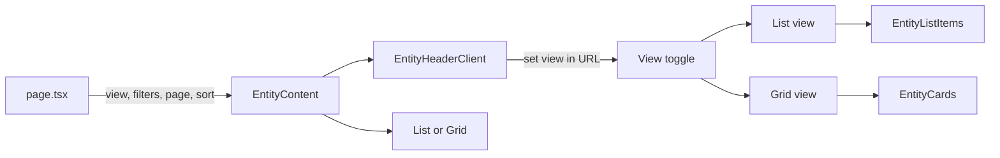

# List / Grid View Toggle

## When to Use This Skill

- Adding a toggle so users can switch between **grid view** (existing cards, default) and **list view** (one horizontal row per item: image + details).
- Default should be **grid view** when no `view` param; list view is the alternative (`?view=list`).
- View preference must be **shareable** (URL) so links open in the correct view.

Use this skill when implementing the same pattern on another section (e.g. cars, pets/for-sale, professional-service). The reference implementation is **pets/for-free**.

## Prerequisites

- Listing page already follows [sima-page-structure](.cursor/rules/sima-page-structure.mdc): `page.tsx` → `{Entity}Content` (server) + `{Entity}HeaderClient` (client) + cards/grid.
- Cards already exist and are wrapped by `Link` in a parent Cards component; each card has title, subtitle, badges, and optionally [LikeButton](.cursor/rules/sima-likes.mdc).
- Styling follows [sima-styling](.cursor/rules/sima-styling.mdc) (Radix UI, styled-components, CSS variables).

## Architecture Overview



- **Page:** Reads `view` from `searchParams`; **default `grid`** when param missing or not `list`. Passes `view` to Content.
- **Content (server):** Accepts `view: "list" | "grid"`. Renders either list wrapper + list items or existing grid + cards.
- **Header (client):** Renders view toggle (list icon / grid icon). Derives current view from URL; on click updates URL with `view` and `page=1`, preserving other params.
- **Grid view (default):** Unchanged existing cards grid.
- **List view:** New list container + list item component; same data as cards, different layout (one row per item: image section + details section).

## Implementation Steps

### Step 1: Page — URL and view param

**File:** `app/(public)/{category}/{entity}/page.tsx`

1. Add `view?: string` to the `searchParams` type in the page props interface.
2. Compute view with **default grid** (list only when `?view=list`):
   ```ts
   const view = searchParams?.view === "list" ? "list" : "grid";
   ```
3. Pass `view` to the Content component:
   ```ts
   <EntityContent ... view={view} />
   ```
4. Optionally include `view` in the Suspense `contentKey` if you want view changes to trigger refetch (usually not needed; list and grid use the same data).

**Reference:** [pets/for-free/page.tsx](client/src/app/(public)/pets/for-free/page.tsx)

### Step 2: Content — Conditional list or grid

**File:** `app/(public)/{category}/{entity}/_components/{Entity}Content/{Entity}Content.tsx`

1. Add prop `view: "list" | "grid"` to the Content props interface.
2. Conditionally render:
   - **When `view === "list"`:** A wrapper (e.g. `Box` with `mt="25px"`) around the new list component that receives the same data array (e.g. `pets={response.data}` or `entities={response.data}`).
   - **When `view === "grid"`:** Keep the existing grid (e.g. `EntityGrid`) and cards component unchanged.
3. Pagination and header stay the same for both views.

**Example:**

```tsx
{view === "list" ? (
  <Box mt="25px" width="100%">
    <EntityList entities={response.data} />
  </Box>
) : (
  <EntityGrid mt="25px" gap="3" columns={{ initial: "1", xs: "2", md: "3" }} width="auto">
    <EntityCards entities={response.data} />
  </EntityGrid>
)}
```

**Reference:** [PetForFreeContent.tsx](client/src/app/(public)/pets/for-free/_components/PetForFreeContent/PetForFreeContent.tsx)

### Step 3: Header client — View toggle UI

**File:** `app/(public)/{category}/{entity}/_components/{Entity}HeaderClient/{Entity}HeaderClient.tsx`

1. **Current view from URL** (default grid):  
   `const currentView = searchParams.get("view") === "list" ? "list" : "grid";`
2. **View change handler:**  
   Create a function that builds new URL params from current `searchParams`, sets `view` to `"list"` or `"grid"`, sets `page` to `"1"`, then calls `router.replace(\`${pathname}?${params.toString()}\`)`. Preserve all other params (filters, sort).
   ```ts
   const handleViewChange = useCallback((nextView: "list" | "grid") => {
     const params = new URLSearchParams(searchParams);
     params.set("view", nextView);
     params.set("page", "1");
     router.replace(`${pathname}?${params.toString()}`);
   }, [pathname, router, searchParams]);
   ```
3. **Toggle UI:**  
   In the same header row as the existing controls (e.g. sort), add two icon buttons:
   - **List:** Use `ListBulletIcon` or `ViewHorizontalIcon` from `@radix-ui/react-icons`. `aria-label="Список"`, `aria-pressed={currentView === "list"}`. When active: `variant="soft"`, `color="accent"`. When inactive: `variant="ghost"`, `color="gray"`.
   - **Grid:** Use `ViewGridIcon`. `aria-label="Сетка"`, `aria-pressed={currentView === "grid"}`. Same variant/color logic for active vs inactive.
4. Wrap the two view buttons in a `Flex` (e.g. `gap="1"`) and place them next to the sort control (e.g. inside a parent `Flex gap="2" wrap="wrap"`).

**Reference:** [PetForFreeHeaderClient.tsx](client/src/app/(public)/pets/for-free/_components/PetForFreeHeaderClient/PetForFreeHeaderClient.tsx)

### Step 4: List container component

**File:** `app/(public)/{category}/{entity}/_components/{Entity}List/{Entity}List.tsx`

1. Client or server: can be either; if it only maps and renders links + list items, server is fine. If you need client hooks inside, use `"use client"`.
2. Props: receive the same array type as the cards (e.g. `entities: SerializedEntity[]`).
3. Layout: single column, vertical stack. Use Radix `Flex` with `direction="column"`, `gap="3"`, `width="100%"`.
4. For each entity: wrap the list item in `Link` (from `@radix-ui/themes` or `next/link`) pointing to the detail page (e.g. `/{category}/{entity}/${entity.publicId}`). Render the list item component with the entity.

**Reference:** [PetForFreeList.tsx](client/src/app/(public)/pets/for-free/_components/PetForFreeList/PetForFreeList.tsx)

### Step 5: List item component

**File:** `app/(public)/{category}/{entity}/_components/{Entity}List/{Entity}ListItem.tsx`

1. **Directive:** `"use client"` if the item uses hooks (e.g. LikeButton) or interactive elements.
2. **Layout (desktop):** One horizontal row: **image section** (left or right, per section preference) ~30–40% width, **details section** ~60–70%.
3. **Layout (mobile):** Stack vertically: image on top, then details (use `Flex direction={{ initial: "column", sm: "row" }}` or equivalent in styled-components with breakpoint).
4. **Image section:**
   - Single image (e.g. first image only) for list view. Use Next.js `Image` with `fill`, `style={{ objectFit: "cover" }}`, and a container with fixed height (e.g. 180px mobile, 200px desktop). Use `position: relative` on the container.
   - Optional: section-specific overlay badges on the image (e.g. “Price reduced”); not required for pets.
5. **Details section:**
   - **LikeButton** in the top-right of the details area with `stopPropagation` so clicking it doesn’t navigate. Use the same entity type and `publicId` as on the card. Position via a styled wrapper (e.g. absolute top-right, z-index above content).
   - **Title** (e.g. animal + kind, or car make + model): same as card, `Heading` size 4 or 5.
   - **Subtitle** (e.g. gender • age, or specs): same as card, `Text` size 2, color gray.
   - **Price or status** (e.g. “Бесплатно” or “₪ 40,000”): prominent, bold.
   - **Badges:** Same as card (location, category, tags, etc.) in a horizontal flex with wrap.
6. Reuse the same formatting helpers and data as the existing card (e.g. `getCityById`, `formatGender`, entity-specific getters) so title/subtitle/badges stay in sync.

**Reference:** [PetForFreeListItem.tsx](client/src/app/(public)/pets/for-free/_components/PetForFreeList/PetForFreeListItem.tsx)

### Step 6: List item styles

**File:** `app/(public)/{category}/{entity}/_components/{Entity}List/{Entity}ListItem.styles.ts`

1. **Directive:** `"use client"` at the top (required for styled-components in this project).
2. **Components to define (extend Radix where possible):**
   - **Item box:** Wrapper with `width: 100%`, `border-radius: var(--radius-3)`, `overflow: hidden`.
   - **Item card:** `styled(Card)` with `variant="surface"`, flex row on desktop and column on mobile. Use `@media (min-width: ${breakpoints.sm}px)` for row; default column. `box-shadow: inset var(--shadow-4)` to match cards.
   - **Image section:** Fixed height on mobile (e.g. 180px), on desktop use a percentage or min/max width (e.g. 35%, min 200px, max 280px) and height 200px. `flex-shrink: 0`, `background: var(--gray-3)` for placeholder.
   - **Image container:** `position: relative`, `height: 100%`, `width: 100%` for Next.js `Image` with `fill`.
   - **Details section:** `flex: 1`, `flex-direction: column`, `padding: var(--space-3)`, `gap: var(--space-2)`, `min-width: 0`, `position: relative`.
   - **Like wrapper:** `position: absolute`, top-right of details, `z-index: 1`.
   - **Badges container:** `Flex` with `flex-wrap: wrap`, `gap: var(--space-1)`.
3. Import `breakpoints` from `@/globals` for media queries. Prefer Radix responsive props in JSX where possible; use media queries in styles only when layout (e.g. flex direction, image width/height) must change by breakpoint.

**Reference:** [PetForFreeListItem.styles.ts](client/src/app/(public)/pets/for-free/_components/PetForFreeList/PetForFreeListItem.styles.ts)

## Section-specific choices

| Choice | Description | Pets/for-free / professional-service |
|--------|-------------|--------------------------------------|
| Image position | Image left vs image right in list row | Left |
| Default view | When no `view` param | **Grid** |
| List image | First image only vs carousel | First only |
| Overlay on image | e.g. “Price reduced” badge | None |

When reusing in another section (e.g. cars), decide image left vs right and any overlay; keep URL and header toggle behavior the same.

## Responsiveness

- **List item:** Row on `sm` and up, column below. Image section height fixed (e.g. 180px → 200px at `sm`); details take remaining space.
- **Header:** Toggle and sort in a flex row with `wrap="wrap"` so they wrap on narrow screens without breaking layout.

## Accessibility

- View toggle buttons: `aria-label` (“Список”, “Сетка”) and `aria-pressed` for the active view.
- LikeButton inside list item: must use `stopPropagation` so clicking like does not trigger the row `Link`.

## Checklist (reuse in new section)

- [ ] Page: `view` in searchParams type; compute `view` (default **grid**); pass to Content.
- [ ] Content: `view` prop; conditionally render list wrapper or grid + cards.
- [ ] Header client: `currentView` from URL; `handleViewChange` updates URL with `view` and `page=1`, preserves other params; two IconButtons (list + grid) with active state and aria attributes.
- [ ] List container: vertical Flex, map entities to Link + list item.
- [ ] List item: image section + details section; same title/subtitle/badges/like as card; responsive row/column; LikeButton with stopPropagation.
- [ ] List item styles: "use client"; card-like container; image and details sections; breakpoints from `@/globals`.

## References

- **Reference implementation:** `client/src/app/(public)/pets/for-free/` (page, PetForFreeContent, PetForFreeHeaderClient, PetForFreeList, PetForFreeListItem, PetForFreeListItem.styles.ts).
- **Related:** [sima-page-structure](.cursor/rules/sima-page-structure.mdc), [sima-styling](.cursor/rules/sima-styling.mdc), [sima-likes](.cursor/rules/sima-likes.mdc).
