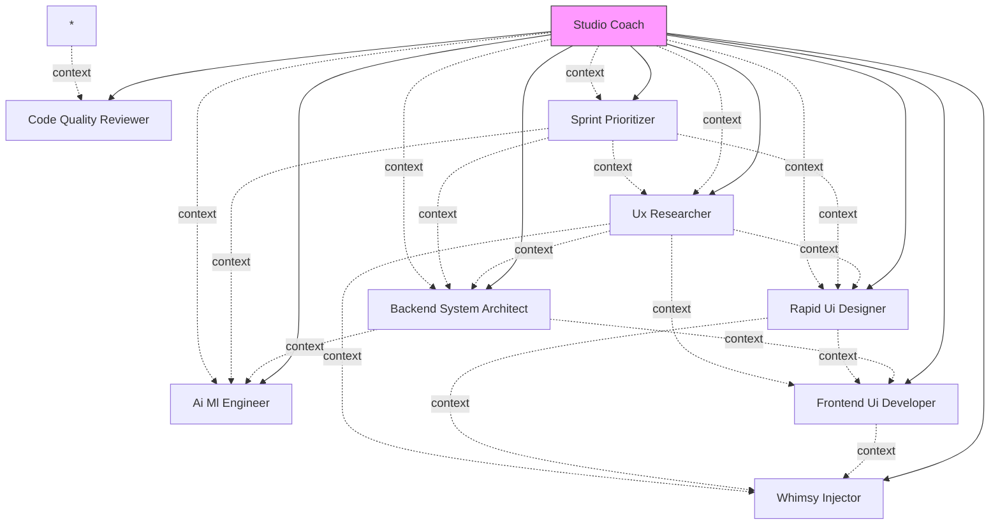

# AI Agent Hub - Orchestration System

*Enhanced with intelligent agent metadata and context flow*

## Agent Registry

*Dynamically generated from installed agents*

### Studio Coach 🎬
- **Role**: Master orchestrator agent that coordinates all other agents to build complete solutions.
- **Tools**: Task, Write, Read
- **Orchestrates**: Ai Ml Engineer, Backend System Architect, Code Quality Reviewer, Frontend Ui Developer, Rapid Ui Designer, Sprint Prioritizer, Ux Researcher, Whimsy Injector
- **Trigger**: "Use Studio Coach to [task]"

### Ai Ml Engineer 🤖
- **Role**: Use this agent when you need to design, implement, or optimize AI/ML solutions for production applications.
- **Tools**: Bash, Glob, Grep, LS, Read, Edit, MultiEdit, Write, NotebookEdit, WebFetch, TodoWrite, WebSearch, BashOutput, KillBash
- **Reads from**: Backend System Architect, Sprint Prioritizer, Studio Coach
- **Writes to**: Backend System Architect, Frontend Ui Developer, Code Quality Reviewer
- **Provides**: model_architecture, inference_endpoints, ml_requirements, performance_metrics
- **Trigger**: "Use Ai Ml Engineer to [task]"

### Backend System Architect 🏗️
- **Role**: Use this agent when you need to design, review, or optimize backend architecture and server-side systems.
- **Tools**: Bash, Glob, Grep, LS, Read, Edit, MultiEdit, Write, NotebookEdit, WebFetch, TodoWrite, WebSearch, BashOutput, KillBash
- **Reads from**: Ux Researcher, Sprint Prioritizer, Studio Coach
- **Writes to**: Frontend Ui Developer, Ai Ml Engineer, Code Quality Reviewer
- **Provides**: api_design, database_schema, architecture_decisions
- **Trigger**: "Use Backend System Architect to [task]"

### Code Quality Reviewer ✅
- **Role**: Use this agent when you need to review code for compliance with established quality standards, after implementing new features, before committing changes, or when refactoring existing code.
- **Tools**: Glob, Grep, LS, Read, Edit, MultiEdit, Write, NotebookEdit, WebFetch, TodoWrite, WebSearch, BashOutput, KillBash, mcp__ide__getDiagnostics, mcp__ide__executeCode, Bash
- **Reads from**: *
- **Writes to**: Studio Coach
- **Provides**: review_results, issues_found, approval_status, quality_metrics
- **Trigger**: "Use Code Quality Reviewer to [task]"

### Frontend Ui Developer 💻
- **Role**: Use this agent when you need to create, modify, or optimize frontend user interfaces and components.
- **Tools**: Bash, Glob, Grep, LS, Read, Edit, MultiEdit, Write, NotebookEdit, WebFetch, TodoWrite, WebSearch, BashOutput, KillBash
- **Reads from**: Backend System Architect, Rapid Ui Designer, Ux Researcher
- **Writes to**: Code Quality Reviewer, Whimsy Injector
- **Trigger**: "Use Frontend Ui Developer to [task]"

### Rapid Ui Designer 🎨
- **Role**: Use this agent when you need to design user interfaces that balance aesthetic excellence with practical implementation constraints, especially within tight development timelines.
- **Reads from**: Ux Researcher, Sprint Prioritizer, Studio Coach
- **Writes to**: Frontend Ui Developer, Whimsy Injector
- **Provides**: design_system, component_specs, ui_patterns, visual_hierarchy
- **Trigger**: "Use Rapid Ui Designer to [task]"

### Sprint Prioritizer 📊
- **Role**: Use this agent when planning 6-day development cycles, prioritizing features, managing product roadmaps, or making trade-off decisions.
- **Tools**: Write, Read, TodoWrite, Grep
- **Reads from**: Studio Coach
- **Writes to**: *
- **Provides**: priorities, constraints, deadlines, sprint_goals, velocity_data
- **Trigger**: "Use Sprint Prioritizer to [task]"

### Ux Researcher 🔍
- **Role**: Use this agent when conducting user research, analyzing user behavior, creating journey maps, or validating design decisions through testing.
- **Tools**: Write, Read, MultiEdit, WebSearch, WebFetch
- **Reads from**: Studio Coach, Sprint Prioritizer
- **Writes to**: Rapid Ui Designer, Backend System Architect, Frontend Ui Developer
- **Provides**: user_requirements, user_flows, personas, journey_maps, usability_findings
- **Trigger**: "Use Ux Researcher to [task]"

### Whimsy Injector ✨
- **Role**: PROACTIVELY use this agent after any UI/UX changes to ensure delightful, playful elements are incorporated.
- **Tools**: Read, Write, MultiEdit, Grep, Glob
- **Reads from**: Frontend Ui Developer, Rapid Ui Designer, Ux Researcher
- **Writes to**: Code Quality Reviewer, Studio Coach
- **Provides**: animations, delighters, micro_interactions, easter_eggs
- **Trigger**: "Use Whimsy Injector to [task]"

## Quick Start

Say: **"Use Studio Coach to [your request]"** to begin orchestrated development.

## Context Flow

### Context Dependencies

- **Frontend Ui Developer** depends on: api_contracts, design_system, user_flows

## Agent Capabilities Matrix

| Agent | Planning | Design | Backend | Frontend | ML/AI | Quality | Research | Delight |
|-------|-------|-------|-------|-------|-------|-------|-------|-------|
| Studio Coach | ✓ | - | - | - | - | ✓ | - | - |
| Ai Ml Engineer | - | - | ✓ | - | ✓ | - | - | - |
| Backend System Architect | - | - | ✓ | - | - | - | - | - |
| Code Quality Reviewer | - | - | - | - | - | ✓ | - | - |
| Frontend Ui Developer | - | - | - | ✓ | - | - | - | - |
| Rapid Ui Designer | - | ✓ | - | ✓ | - | - | - | - |
| Sprint Prioritizer | ✓ | - | - | - | - | - | - | - |
| Ux Researcher | ✓ | ✓ | - | - | - | - | ✓ | - |
| Whimsy Injector | - | ✓ | - | - | - | - | - | ✓ |

## Agent Invocation Examples

### Common Patterns

**Studio Coach**:
- "Use Studio Coach to [specific task]"

**Ai Ml Engineer**:

**Backend System Architect**:
- "Use Backend System Architect to i need to build a backend for a social media app that can handle millions of users"
- "Use Backend System Architect to can you review my current api structure and suggest improvements?"
- "Use Backend System Architect to our database is becoming a bottleneck as we grow. what should we do?"

**Code Quality Reviewer**:
- "Use Code Quality Reviewer to i've created a new userprofile component"
- "Use Code Quality Reviewer to added a new endpoint for user authentication"
- "Use Code Quality Reviewer to i'm splitting the orderservice class into smaller modules"

**Frontend Ui Developer**:
- "Use Frontend Ui Developer to i need a searchable dropdown component with keyboard navigation"
- "Use Frontend Ui Developer to my react app is re-rendering too frequently and feels sluggish"
- "Use Frontend Ui Developer to this layout breaks on mobile devices and tablets"

**Rapid Ui Designer**:
- "Use Rapid Ui Designer to design a dashboard for our analytics feature that shows user engagement metrics"
- "Use Rapid Ui Designer to we need to design a reusable component system for our react app"
- "Use Rapid Ui Designer to our checkout flow looks dated and has poor conversion - redesign it"

**Sprint Prioritizer**:
- "Use Sprint Prioritizer to we have 50 feature requests but only 6 days"
- "Use Sprint Prioritizer to should we build ai chat or improve onboarding?"
- "Use Sprint Prioritizer to the ceo wants us to add video calling to this sprint"

**Ux Researcher**:
- "Use Ux Researcher to we want to add a mood tracking feature but aren't sure what users really need"
- "Use Ux Researcher to our onboarding has a 60% drop-off rate"
- "Use Ux Researcher to should we use a tab bar or hamburger menu for navigation?"
- "Use Ux Researcher to we need to better understand our target users for the fitness app"

**Whimsy Injector**:
- "Use Whimsy Injector to i've added the new onboarding flow for the app"
- "Use Whimsy Injector to set up error handling for the payment flow"
- "Use Whimsy Injector to build a loading spinner for the data fetch"
- "Use Whimsy Injector to the user profile page is done"

## MCP Servers Available

Your project has been configured with these MCP servers:
- **Memory** - Persistent conversation context
- **Sequential Thinking** - Step-by-step reasoning
- **Context7** - Advanced context management
- **Playwright** - Browser automation capabilities

## Tips for Best Results

- Be specific about your requirements
- Let Studio Coach orchestrate complex tasks
- Use direct agent calls for focused work
- Review the context flow to understand agent dependencies
- Check the capabilities matrix to find the right agent

---
*Generated by AI Agent Hub - Your AI development team is ready!*